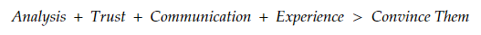

---
# A Demo section created with the Blank widget.
# Any elements can be added in the body: https://wowchemy.com/docs/writing-markdown-latex/
# Add more sections by duplicating this file and customizing to your requirements.

widget: hero # See https://wowchemy.com/docs/page-builder/
headless: true # This file represents a page section.
weight: 10 # Order that this section will appear.
title: |
  Field Guide to Compelling Analytics
hero_media: welcome.jpg
design:
  # Choose how many columns the section has. Valid values: 1 or 2.
  columns: '2'
  # Add custom styles
  css_style:
  css_class:
---

 

<bold>Field Guide to Compelling Analytics</bold> is written for Analytics Professionals (APs) who want to increase their probability of success in implementing analytical solutions. In the past, soft skills such as presentation and persuasive writing techniques have been the extent of teaching junior APs how to effectively communicate the value of analytical products. However, there are other aspects to success such as trust and experience that may play a more important role in convincing fellow APs, clients, advisors, and leadership groups that their analytic solutions will work.

 

This book introduces the formula 

 

 

to illustrate an AP’s ability to convince a stakeholder. The ‘Convince Me’ stakeholders might be an analytics team member, team lead, decision-maker, or senior leader that are either internal or external to the AP’s organization. Whoever they are, this formula represents a concise, digestible, and above all practical means to increase the likelihood that you will be able to persuade them of the value of your analytical product.

<bold>Features</bold>

- Includes insight questions to support class discussion.
- Written in broadly non-mathematical terms, designed to be accessible to any level of student or practicing AP to read, understand, and implement the concepts.
- Each section introduces the ideas through real-life case studies.

